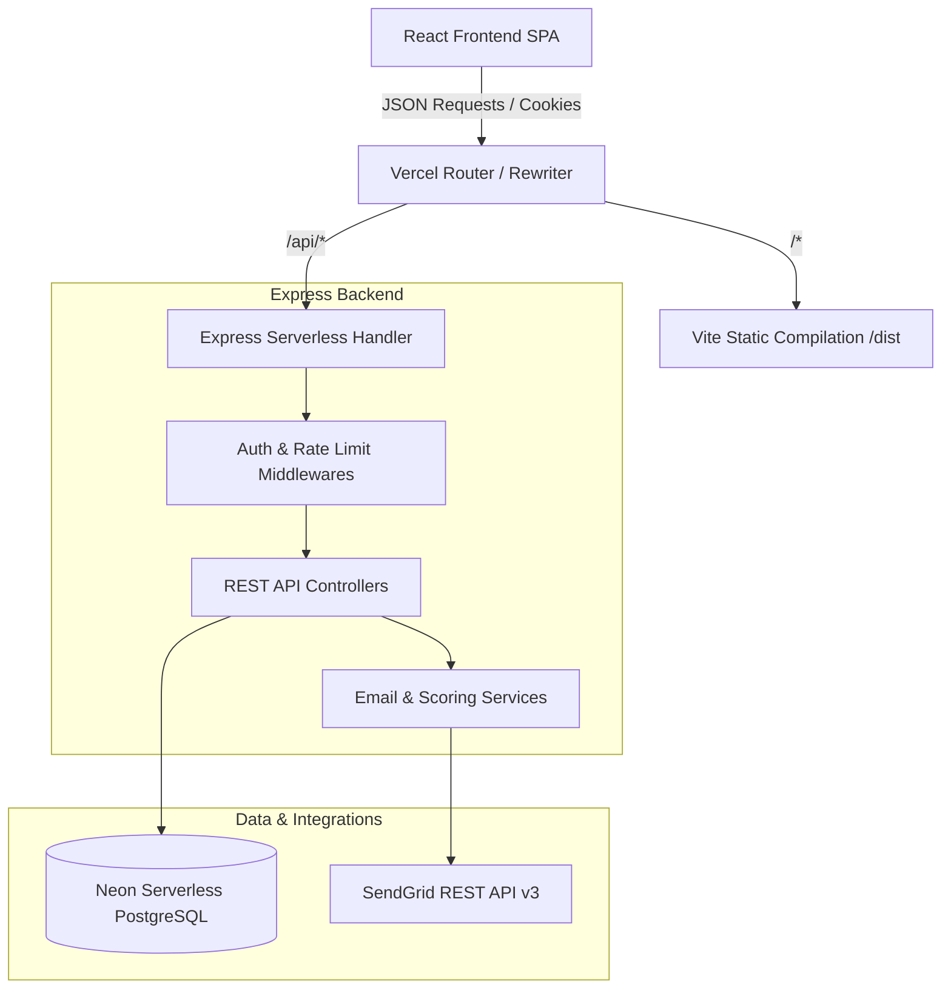
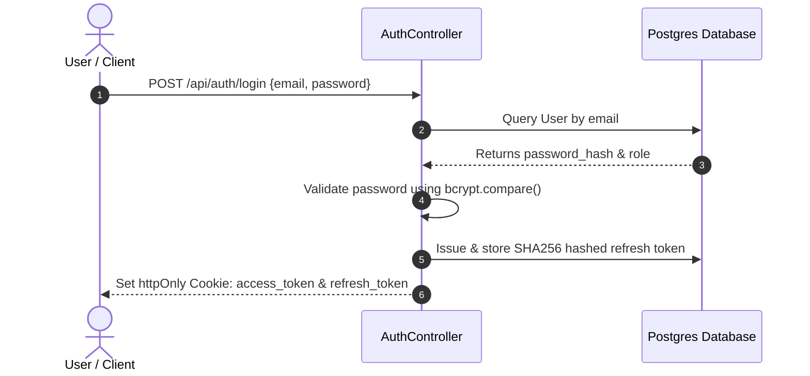
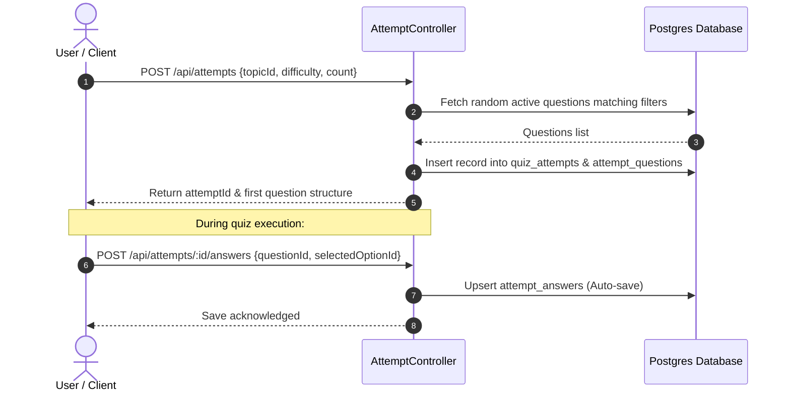
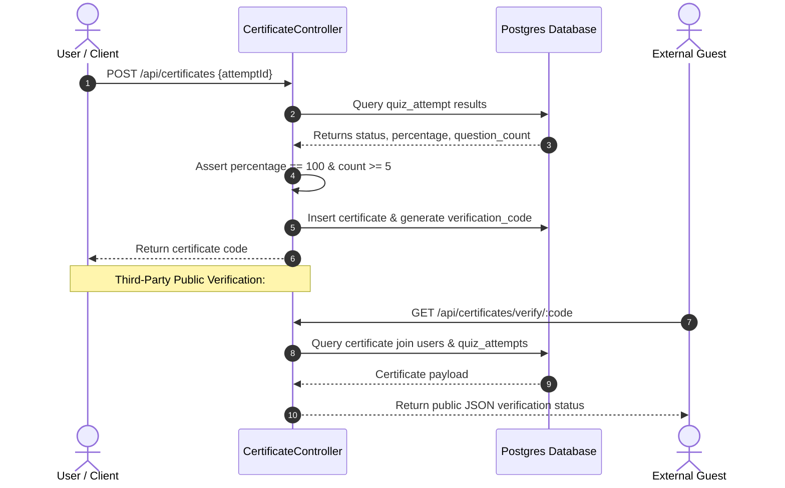
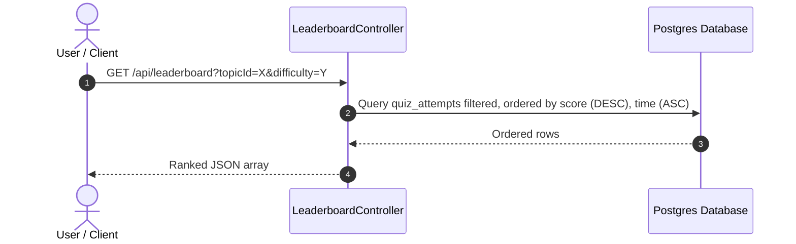
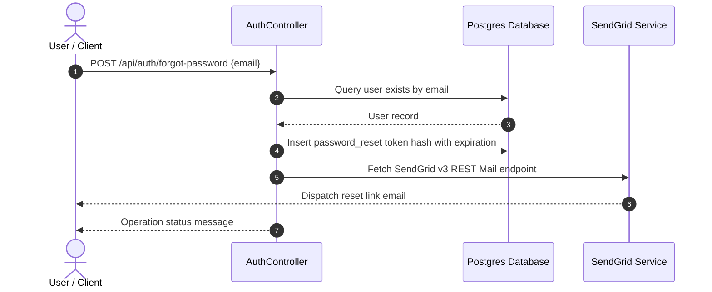

# System Architecture

This document maps the architectural interfaces, component lifecycles, and backend integrations of QuizArena.

---

## High-Level System Overview

---

## Feature Workflows

### 1. Authentication Flow

### 2. Quiz Attempt Engine

### 3. Certificate Issuance & Verification

### 4. Leaderboard Calculation

### 5. Password Reset Request

