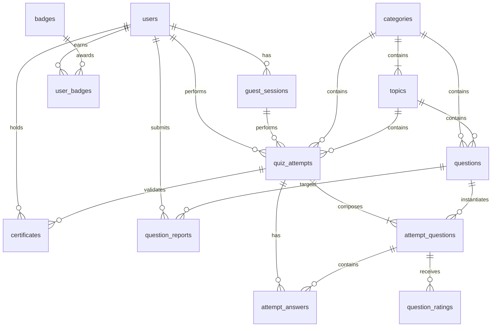

# Database Schema

This document details the PostgreSQL schema, indexes, and primary/foreign key relationships of QuizArena.

---

## Entity Relationship (ER) Diagram

---

## Table Schemas

### 1. `users`
Tracks user credentials, profile states, and gamified statistics.
- **`id`** (`uuid`, Primary Key): Generated via `gen_random_uuid()`.
- **`email`** (`string`, Unique, Not Null): Lowercase user email.
- **`password_hash`** (`string`, Not Null): Salted Bcrypt hash.
- **`display_name`** (`string`, Not Null): Profile display name.
- **`role`** (`string`, Default: `'user'`): Authorization tier (`'user'` or `'admin'`).
- **`total_xp`** (`integer`, Default: `0`): Cumulative points accumulated.
- **`current_level`** (`integer`, Default: `1`): Computed experience tier.
- **`current_streak`** (`integer`, Default: `0`): Consecutive active learning days.
- **`longest_streak`** (`integer`, Default: `0`): Maximum consecutive learning days.
- **`last_activity_date`** (`date`): Timestamp of the last quiz interaction.

### 2. `guest_sessions`
Temporary guest identifiers for anonymous quiz takers.
- **`id`** (`uuid`, Primary Key)
- **`token_hash`** (`string`, Unique, Not Null): SHA-256 hash of the browser token.
- **`expires_at`** (`timestamp with time zone`, Not Null)

### 3. `categories`
Top-level domains of knowledge (e.g. computer science, medicine).
- **`id`** (`serial`, Primary Key)
- **`name`** (`string`, Not Null)
- **`slug`** (`string`, Unique, Not Null)
- **`description`** (`text`)
- **`icon`** (`string`)
- **`is_active`** (`boolean`, Default: `true`)

### 4. `topics`
Subdomains of quiz categories (e.g. databases, anatomy).
- **`id`** (`serial`, Primary Key)
- **`category_id`** (`integer`, FK references `categories.id`): Cascade on delete.
- **`name`** (`string`, Not Null)
- **`slug`** (`string`, Unique, Not Null)
- **`description`** (`text`)
- **`is_active`** (`boolean`, Default: `true`)

### 5. `questions`
Core question bank repository.
- **`id`** (`uuid`, Primary Key)
- **`category_id`** (`integer`, FK references `categories.id`)
- **`topic_id`** (`integer`, FK references `topics.id`)
- **`difficulty`** (`string`, Not Null): `'easy'`, `'medium'`, or `'hard'`.
- **`question_type`** (`string`, Default: `'single_choice'`)
- **`question_text`** (`text`, Not Null)
- **`options_json`** (`jsonb`, Not Null): Option options array.
- **`correct_answer_json`** (`jsonb`, Not Null): Correct selection indexes.
- **`hint`** (`text`)
- **`explanation`** (`text`, Not Null)
- **`status`** (`string`, Default: `'published'`)

### 6. `quiz_attempts`
Tracks a single timed quiz session.
- **`id`** (`uuid`, Primary Key)
- **`user_id`** (`uuid`, FK references `users.id`, Nullable)
- **`guest_session_id`** (`uuid`, FK references `guest_sessions.id`, Nullable)
- **`category_id`** (`integer`, FK references `categories.id`)
- **`topic_id`** (`integer`, FK references `topics.id`)
- **`difficulty`** (`string`, Not Null)
- **`quiz_mode`** (`string`, Default: `'assessment'`): `'assessment'` or `'practice'`.
- **`status`** (`string`, Default: `'in_progress'`): `'in_progress'` or `'submitted'`.
- **`total_score`** (`decimal(5,2)`, Default: `0.00`): Points awarded.
- **`max_score`** (`integer`, Not Null): Total possible score.
- **`percentage`** (`decimal(5,2)`, Default: `0.00`)
- **`xp_earned`** (`integer`, Default: `0`)
- **`time_taken_seconds`** (`integer`, Default: `0`)

### 7. `attempt_questions`
Maps questions to a specific quiz attempt.
- **`id`** (`uuid`, Primary Key)
- **`attempt_id`** (`uuid`, FK references `quiz_attempts.id`, Cascade)
- **`question_id`** (`uuid`, FK references `questions.id`)
- **`question_snapshot_json`** (`jsonb`, Not Null): Freezes question properties to prevent modifications mid-quiz.
- **`position`** (`integer`, Not Null): Zero-indexed order of questions.
- **`option_order_json`** (`jsonb`, Not Null): Array mapping option orders.
- **`eliminated_options_json`** (`jsonb`): Tracks 50/50 lifeline adjustments.

### 8. `attempt_answers`
Saves draft selections and graded records for each question.
- **`id`** (`uuid`, Primary Key)
- **`attempt_id`** (`uuid`, FK references `quiz_attempts.id`, Cascade)
- **`attempt_question_id`** (`uuid`, FK references `attempt_questions.id`, Cascade)
- **`selected_option_id`** (`string`): Chosen option key.
- **`is_correct`** (`boolean`, Default: `null`)
- **`points_awarded`** (`decimal(3,2)`, Default: `null`)
- **`hint_used`** (`boolean`, Default: `false`)
- **`fifty_fifty_used`** (`boolean`, Default: `false`)
- **`flagged`** (`boolean`, Default: `false`)

### 9. `certificates`
Validatable credentials awarded on 100% scores.
- **`id`** (`uuid`, Primary Key)
- **`attempt_id`** (`uuid`, Unique, FK references `quiz_attempts.id`, Cascade)
- **`user_id`** (`uuid`, FK references `users.id`, Cascade)
- **`verification_code`** (`string`, Unique, Not Null): Cryptographic lookup string.
- **`created_at`** (`timestamp with time zone`)
